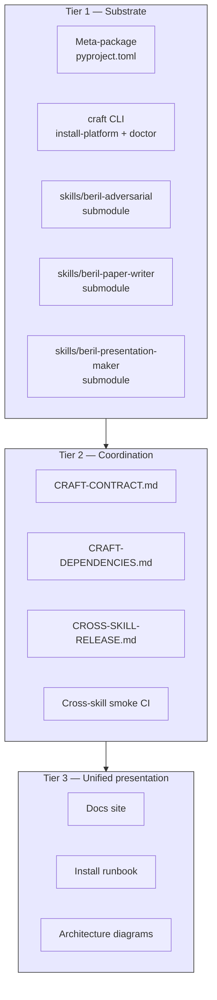

# Platform structure

CRAFT is a **three-tier wrapper** around the three production
skills. Each tier exists for a specific reason — substrate
(install + meta-package), coordination (contract + release
runbook), and presentation (this docs site).

## The three tiers



### Tier 1 — substrate

The thing you `pipx install`. Lives in this repo's
`pyproject.toml`, `src/craft/`, and the three git submodules
under `skills/`.

- **`pyproject.toml`** — meta-package. Lists the three skills as
  pinned `pip` dependencies (`beril-adversarial-skill @ git+https://...@v0.7.0.9`
  etc.). `pipx install craft` transitively installs all three.
- **`src/craft/cli.py`** — provides `craft install-platform`,
  `craft doctor`, `craft version`. The install-platform command
  runs the three per-skill `install-skill` invocations in
  sequence and reports a summary.
- **`skills/` git submodules** — each skill stays in its own
  repo with its own release cycle, tags, and issue tracker. CRAFT
  references each at a **specific tagged commit** (e.g.,
  `beril-presentation-maker-skill @ v1.0.0`).

**Key choice: git submodules, NOT mono-repo subdirs.** Per-skill
release independence is the load-bearing requirement; the
platform layer adds coordination without forcing a single
release cycle. Bumping a submodule pin is an explicit,
reviewable PR — exactly when you want coordinated cross-skill
release attention.

### Tier 2 — coordination

The substantive new capability beyond the three skills'
existing operational surface. Four components, all in the
platform repo root:

- **[Cross-skill contract](contract.md)** (`CRAFT-CONTRACT.md`)
  — codifies every interface contract the three skills share:
  schema versioning, the 4-zone draft layout, the audit-JSON
  shape, the `claude -p` subagent invocation pattern, the
  `.claude/skills/` deployment convention, the env-var contract.
- **Dependencies watchlist** (`CRAFT-DEPENDENCIES.md`) — lists
  every external dependency (Anthropic Claude Code, KBase | BERIL,
  Python ecosystem, image-gen providers) + a "last verified
  working with" date + quarterly review cadence.
- **[Release runbook](../operations/release-runbook.md)**
  (`CROSS-SKILL-RELEASE.md`) — coordinated runbook for changes
  that touch all three skills (e.g., adversarial schema bump).
- **Cross-skill smoke CI** (`.github/workflows/cross-skill-smoke.yml`)
  — GitHub Action that exercises the full Tier-0 workflow
  against a real BERIL project. Runs on manual dispatch +
  quarterly schedule. Catches integration breakage within hours
  of any submodule bumping its pin.

### Tier 3 — unified presentation

This docs site. Built with MkDocs Material; deployed to GitHub
Pages on push to main.

- **Platform landing** ([Home](../index.md)) — what is this
  platform, what does it do, where to go from here.
- **Quick start** ([Install](../quick-start/install.md) →
  [First run](../quick-start/first-run.md) →
  [Verify](../quick-start/verify.md)).
- **Per-skill pages** ([adversarial](../skills/adversarial.md),
  [paper-writer](../skills/paper-writer.md),
  [presentation-maker](../skills/presentation-maker.md)) — pull
  from each submodule's README via the `include-markdown`
  plugin. Per-skill maintenance unchanged.
- **Architecture diagrams** (this section) — product-facing,
  not dev-process framing.
- **Extension path** ([Adding a skill](../extending/adding-a-skill.md))
  — for future contributors.

## The repository layout

```
craft/
├── README.md                       # platform-level entry doc
├── CRAFT-CONTRACT.md               # cross-skill interface pin
├── CRAFT-DEPENDENCIES.md           # upstream-change watchlist
├── CROSS-SKILL-RELEASE.md          # coordinated release runbook
├── PLATFORM-PROPOSAL.md            # original architectural argument
├── AUGMENTATION-STREAM-RETROSPECTIVE.md  # dev-process context
├── RELEASE_NOTES.md                # per-version platform release notes
├── pyproject.toml                  # meta-package; pins 3 skills
├── mkdocs.yml                      # docs site config
├── src/craft/
│   ├── __init__.py
│   └── cli.py                      # craft install-platform / doctor / version
├── skills/                         # git submodules
│   ├── beril-adversarial-skill/    → submodule @ pinned tag
│   ├── beril-paper-writer-skill/   → submodule @ pinned tag
│   └── beril-presentation-maker-skill/ → submodule @ pinned tag
├── docs/                           # MkDocs source (this site)
│   ├── index.md
│   ├── quick-start/
│   ├── architecture/
│   ├── skills/
│   ├── operations/
│   ├── extending/
│   └── reference/
├── tests/                          # platform CLI unit tests
└── .github/workflows/
    ├── platform-ci.yml             # platform unit-tests on PRs
    ├── cross-skill-smoke.yml       # end-to-end smoke against real BERIL
    └── docs.yml                    # mkdocs gh-deploy
```

## What lives where

| Concern | Where | Why |
|---|---|---|
| Per-skill code, prompts, tests | `<skill-repo>` (submodule) | Skill release independence |
| Per-skill operator docs (README, TUTORIAL, HUB_INSTALL) | `<skill-repo>` (submodule) | Skill author owns them |
| Cross-skill interface contract | `craft/CRAFT-CONTRACT.md` | Shared across all 3 skills |
| Cross-skill release runbook | `craft/CROSS-SKILL-RELEASE.md` | Coordinated multi-skill work |
| Cross-skill smoke test | `craft/.github/workflows/cross-skill-smoke.yml` | Tests integration, not per-skill |
| Unified install | `craft/src/craft/cli.py` (`install-platform`) | Single entry point |
| Unified health check | `craft/src/craft/cli.py` (`doctor`) | Single entry point |
| Platform-level docs site | `craft/docs/` (this site) | Single user-facing surface |

## Skill independence is preserved

Each skill repo continues to:

- Release at its own cadence with its own tags.
- Own its own issue tracker + PR workflow.
- Maintain its own internal docs (`SPEC.md`, `LAYOUT.md`,
  `DECISIONS.md`, `CONTRACT.md`).
- Be installable + usable **independently** of CRAFT (you can
  still `pipx install git+https://github.com/.../beril-paper-writer-skill.git`
  directly without going through CRAFT).

CRAFT adds a coordination layer + a presentation layer on top.
It does NOT subsume the skills.

## See also

- [Cross-skill contract](contract.md) — the interface pin
  itself.
- [Skill relationships](relationships.md) — who consumes whose
  schema; how the Tier-0 workflow composes.
- [Augmentation stream retrospective](retrospective.md) —
  dev-process context that produced these three skills.
- [Platform proposal](../reference/platform-proposal.md) — the
  original architectural argument.
