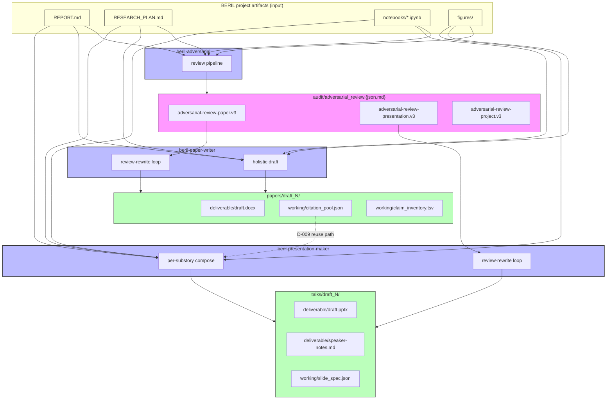
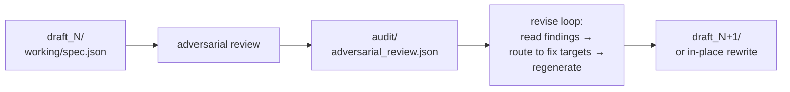
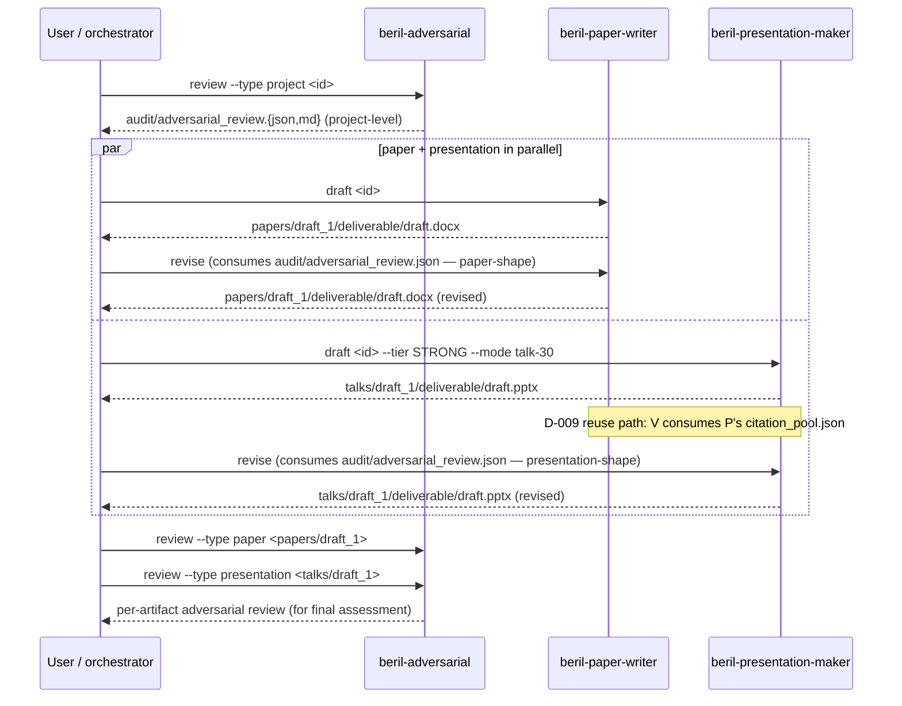

# Skill relationships

How the three CRAFT skills compose. This page walks the
data-flow contract — who produces what, who consumes what, what
sits behind the workflow that the [home page diagram](../index.md)
shows.

## Data-flow contract



## Who produces what

| Producer | Schema / artifact | Version | Consumer(s) |
|---|---|---|---|
| adversarial | `adversarial-review-paper.v3` | v3 (since v0.7.0) | paper-writer |
| adversarial | `adversarial-review-presentation.v3` | v3 (since v0.7.0) | presentation-maker |
| adversarial | `adversarial-review-plan.v3` | v3 | (external; no CRAFT consumer yet) |
| adversarial | `adversarial-review-project.v3` | v3 | (external; no CRAFT consumer yet) |
| paper-writer | `claim_inventory.tsv` | v1 | (external integrators) |
| paper-writer | `citation_pool.json` | v1 | presentation-maker (D-009 reuse-from-paper path) |
| presentation-maker | `slide_spec.v1` | v1 | (external integrators) |
| presentation-maker + paper-writer | `review-cascade.v1` | v1 (M4b pattern) | (external integrators; future review systems) |

The full schema table + stability guarantees lives in the
[cross-skill contract §2](contract.md).

## The 4-zone draft layout

Every CRAFT skill produces drafts under the same KBase | BERIL
convention:

```
<BERIL_ROOT>/projects/<project_id>/{papers,talks}/draft_N/
├── deliverable/           # audience-facing artifacts (.docx, .pptx)
├── narrative/             # decision artifacts (throughline, substory)
├── working/               # machine-readable intermediates (.json, .tsv)
└── audit/                 # logs, cost, review outputs
```

This is non-negotiable for CRAFT membership. External
integrators reading CRAFT outputs can rely on it being stable.
See [contract §3.1](contract.md) for the canonical naming
conventions inside each zone.

## The review-rewrite loop

Both drafter skills (paper-writer + presentation-maker) consume
adversarial review the same way:



The drafter:

1. Produces a draft with full audit trail in `audit/`.
2. The user (or `craft` orchestration) runs adversarial review
   against the draft.
3. The drafter's `revise` verb (paper-writer:
   `beril-paper-writer revise`; presentation-maker:
   `beril-presentation-maker revise`) reads the adversarial JSON
   from `audit/adversarial_review.json`, routes each finding to
   its `fix_target` prompt/stage, and regenerates either
   in-place or to a new `draft_N+1`.

The contract here is: **both drafters consume the same v3
schema shape**. Adversarial doesn't need per-consumer-skill
output; the consumers do the routing.

## Cross-skill independence

Despite the composition, each skill can run **fully independently**:

- You can run `beril-adversarial review --type project` without
  ever invoking paper-writer or presentation-maker. The review
  is useful on its own.
- You can run `beril-paper-writer draft` without an adversarial
  review present. The drafter just skips the revise loop.
- You can run `beril-presentation-maker draft` without either
  paper-writer or adversarial. Same — revise loop becomes a
  no-op; reuse-from-paper path becomes a no-op.

CRAFT is the layer that makes the composition **explicit and
testable**. The skills' independence is preserved.

## The Tier-0 workflow

Putting it together — the platform's first delivery:



The platform doesn't *enforce* this sequence; the skills
coordinate via the artifacts they write under the project's
draft directories. See [first run](../quick-start/first-run.md)
for the actual commands.

## See also

- [Cross-skill contract](contract.md) — the full schema + invariants pin.
- [Augmentation stream retrospective](retrospective.md) —
  how these three skills came to exist as a coherent stream.
- Per-skill operator docs: [adversarial](../skills/adversarial.md),
  [paper-writer](../skills/paper-writer.md),
  [presentation-maker](../skills/presentation-maker.md).
